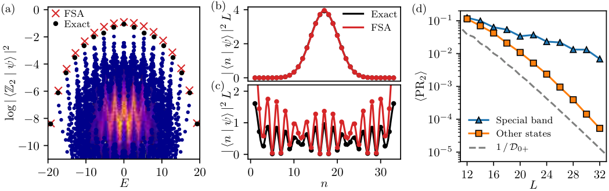
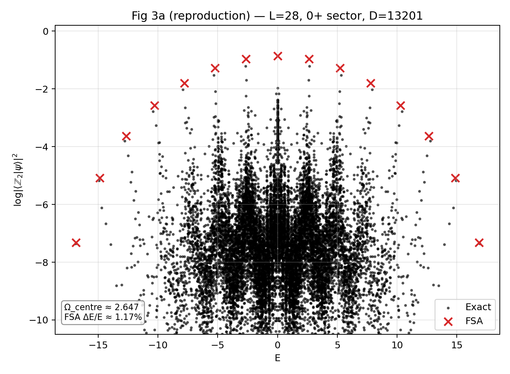
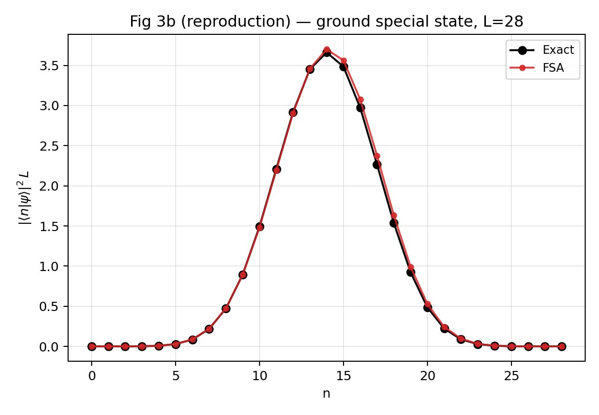
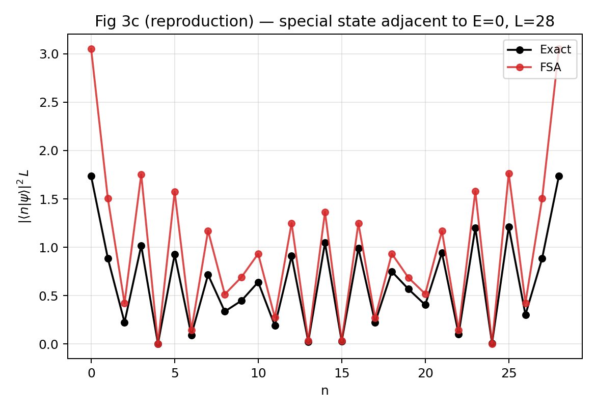
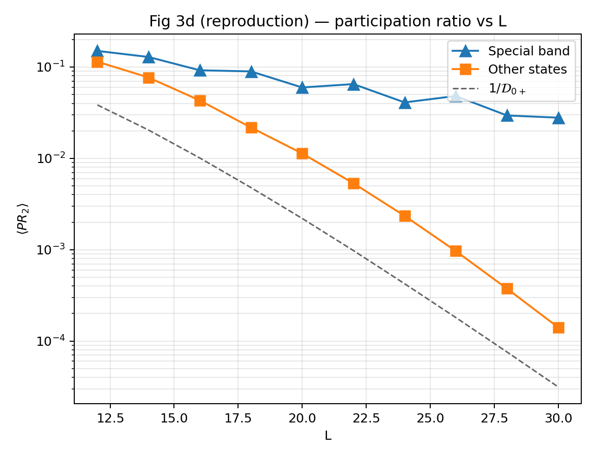
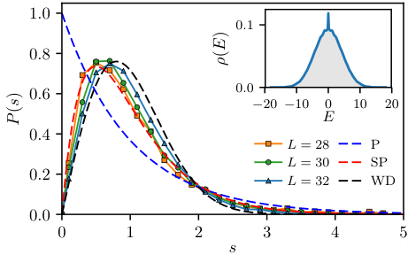
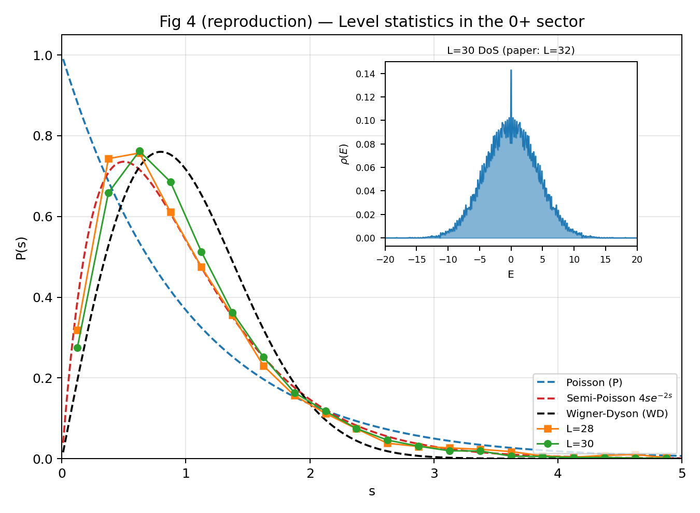

# Harness for Quantum Many-Body Physics

Trustworthy, reproducible, agent-driven quantum many-body research harness. Three pieces hold the harness together: a **knowledge base** of methods, models, and physics; **workflow utilities** including `/solve`, `/reproduce-paper`, and `/verify`; and a **self-correcting state-machine ledger** that catches the agent’s mistakes before they ship.

## What it helps with

- **Solving a concrete problem** — pick a method, run locally or on a cluster, verify, plot.
- **Reproducing a paper end-to-end** — PDF → protocol → script → run → audit → HTML report.
- **Validating with cross-method checks and audit subagents.**

10 model cards and 7 method cards on file.

## Installation

```bash
git clone https://github.com/QuantumBFS/quantum.harness.git
cd quantum.harness
```

Open an agent session in the repo and invoke `/onboard`. The skill installs the harness, optionally captures a cluster profile, and routes you to your first problem.

After onboarding, you can describe a problem at any time and the harness routes itself:
> *Reproduce arXiv:1711.03528.*

> *Ground state of the J1-J2 Heisenberg chain at J2/J1 = 0.5, L = 32, periodic. DMRG, bond-dim sweep to 800.*


Skills you'll use most:

- `/solve` — a concrete calculation, from intake to plot
- `/reproduce-paper` — full paper reproduction
- `/parameter-scan` + `/scaling-fit` — scans and finite-size extrapolation
- `/verify` — audit any artifact via an independent subagent
- `/slurm` — ship and submit on a cluster

Method stacks install on demand; `make help` lists what's available.

## A worked example — Turner et al., *Nature Physics* 2018

End-to-end reproduction of *"Weak ergodicity breaking from quantum many-body scars"* by Turner, Michailidis, Abanin, Serbyn, and Papić ([Nature Physics **14**, 745 (2018)](https://doi.org/10.1038/s41567-018-0137-5)). The PXP model — a chain of Rydberg atoms with a hard no-adjacent-excitations constraint, $H = \sum_i P_{i-1}\, X_i\, P_{i+1}$ — hosts a small set of "scar" eigenstates with anomalously large overlap on the Néel state $\lvert Z_2 \rangle$, in apparent violation of the eigenstate thermalization hypothesis (ETH). The figures below pair the paper's main panels with the harness output. Sizes $L \le 30$ are done; $L = 32$ is still running on the cluster.

### Fig 3 — eigenstate overlaps, FSA, and participation ratio

| Paper (Turner 2018) | This run |
|:---:|:---:|
|  |  |
| **Paper Fig 3.** (a) $\log\lvert\langle Z_2 \vert \psi\rangle\rvert^2$ for every eigenstate in the $(k=0,\,I=+1)$ sector at $L=32$; the forward-scattering approximation (FSA, red ×) marks the scar states on the upper envelope. (b, c) two of those special eigenstates decomposed in the FSA basis. (d) participation ratio $\langle PR_2 \rangle$ vs $L$. | **Our reproduction of panel (a)** at $L=28$, $(k=0,\,I=+1)$ sector, $D = 13{,}201$. The $L+1=29$ FSA states (red ×) sit cleanly above the thermal cloud — the scar tower. Panels (b), (c), (d) in the drop-down. |

<details>
<summary>Panels (b), (c), (d) from the same run</summary>

| (b) ground special state | (c) special state adjacent to $E=0$ |
|:---:|:---:|
|  |  |
| Lowest scar eigenstate decomposed in the FSA basis. Exact (black) and FSA (red) overlap to within ~1%. | Lowest $\lvert E\rvert > 0$ scar eigenstate. Exact and FSA share the alternating-amplitude pattern but diverge in magnitude — where the FSA picture begins to break. |

<p align="center"><br><sub><b>(d)</b> $\langle PR_2 \rangle$ vs $L$. The special band (blue) stays roughly $L$-independent; the bulk (orange) thermalizes as $1/D_{0+}$ (dashed). $L = 12 \to 30$.</sub></p>

</details>

### Fig 4 — level-spacing statistics

| Paper (Turner 2018) | This run |
|:---:|:---:|
|  |  |
| **Paper Fig 4.** Level-spacing distribution $P(s)$ in the $(k=0,\,I=+1)$ sector at $L = 28, 30, 32$, against Poisson (P), semi-Poisson (SP), and Wigner-Dyson (WD). Inset: density of states $\rho(E)$ at $L=32$, dominated by a Gaussian bulk and a sharp $E=0$ spike from the Fibonacci-counted zero modes. | **Our reproduction** at $L=28$ and $L=30$ ($L=32$ pending). $P(s)$ falls on Wigner-Dyson, ruling out integrability. Inset: $\rho(E)$ at $L=30$ with the $E=0$ spike intact. The Hamiltonian is non-integrable; the scar tower is a genuine ETH anomaly. |

A few things the harness caught during this run, recorded as tacits or deviations:

- The first protocol draft used the exact zero mode in Fig 3c. The paper's caption says *"adjacent to $E=0$"*, not *"at $E=0$"* — a different state. The audit subagent flagged it before compute; the [figure-reading checklist](AGENTS.md#pre-compute-figure-reading-checklist) was added in response.
- The protocol declared XDiag as the stack, but the script imported raw SciPy. The script audit caught it; the deviation was recorded properly the second time.
- Dense `eigh` silently segfaulted on OpenBLAS at $D > 60{,}000$. The harness logged the tacit and escalated the $L=32$ cell to a Julia `eigen` worker on the cluster.

## Stack

- **Julia** — ITensors.jl, ITensorMPS.jl, KrylovKit.jl, MPSKit.jl, PEPSKit.jl, XDiag.jl.
- **Python** — NetKet on JAX, QuSpin, TensorCircuit-NG, quimb, cotengra.
- **Agent runtime** — any LLM coding agent that loads skills from `.claude/skills/`; tested on Claude Code and Codex. Skills managed by [Ion](https://github.com/Roger-luo/Ion).
- **Cluster** — Slurm via `/slurm`; per-cluster defaults under `tools/cluster/`.

